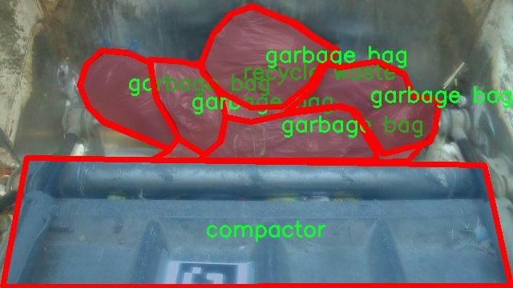

# 垃圾分类图像分割系统： yolov8-seg-C2f-Faster

### 1.研究背景与意义

[参考博客](https://gitee.com/YOLOv8_YOLOv11_Segmentation_Studio/projects)

[博客来源](https://kdocs.cn/l/cszuIiCKVNis)

研究背景与意义

随着城市化进程的加快和人们生活水平的提高，垃圾产生量日益增加，垃圾分类成为解决城市环境问题的重要手段。垃圾分类不仅有助于资源的回收利用，减少环境污染，还能提升公众的环保意识。根据相关研究，科学合理的垃圾分类能够将可回收物与不可回收物有效分离，从而降低垃圾处理的成本，提高资源的再利用率。然而，传统的垃圾分类方法依赖于人工识别，效率低下且容易出现错误，难以满足现代城市管理的需求。因此，开发一种高效、准确的垃圾分类系统显得尤为重要。

近年来，深度学习技术的迅猛发展为图像识别和分割提供了新的解决方案。YOLO（You Only Look Once）系列模型因其高效的实时目标检测能力而受到广泛关注。YOLOv8作为该系列的最新版本，结合了多种先进的深度学习技术，具备了更强的特征提取能力和更高的检测精度。基于YOLOv8的垃圾分类图像分割系统，能够在复杂的环境中对垃圾进行实时检测和分类，为垃圾分类的自动化提供了可能性。

本研究的核心在于改进YOLOv8模型，以适应垃圾分类的特定需求。通过对现有模型的优化，提升其在垃圾图像分割任务中的表现。研究中使用的数据集包含3700张图像，涵盖了13类垃圾，包括塑料袋、纸板、电子废物等。这些类别的多样性为模型的训练提供了丰富的样本，有助于提高分类的准确性和鲁棒性。尤其是在实例分割任务中，模型需要能够准确识别和分割出每一类垃圾的具体位置，这对提高垃圾分类的效率至关重要。

此外，垃圾分类不仅是技术问题，更是社会问题。通过建立基于深度学习的垃圾分类系统，可以为城市管理者提供科学的数据支持，帮助其制定更有效的垃圾管理政策。同时，系统的推广应用将有助于提高公众的参与度，增强居民的环保意识，推动社会向可持续发展转型。

综上所述，基于改进YOLOv8的垃圾分类图像分割系统的研究具有重要的理论和实践意义。它不仅为垃圾分类提供了一种高效的技术手段，也为城市环境管理提供了新的思路。通过不断优化和完善该系统，期望能够在未来的垃圾分类工作中发挥更大的作用，助力实现资源的高效利用和环境的可持续发展。

### 2.图片演示


注意：本项目提供完整的训练源码数据集和训练教程,由于此博客编辑较早,暂不提供权重文件（best.pt）,需要按照6.训练教程进行训练后实现上图效果。

### 3.视频演示

[3.1 视频演示](https://www.bilibili.com/video/BV1of6wYkEr3/)

### 4.数据集信息

##### 4.1 数据集类别数＆类别名

nc: 13
names: ['bag', 'big cardboard', 'bulky', 'compactor', 'dumpster', 'electrical and electronic waste', 'garbage bag', 'glass', 'green waste', 'hygiene', 'plastic bag', 'recycle waste', 'textile']


##### 4.2 数据集信息简介

数据集信息展示

在现代社会，垃圾分类已成为环境保护和资源回收的重要环节。为了提升垃圾分类的效率和准确性，开发一个高效的图像分割系统显得尤为重要。本研究所使用的数据集“OLD_Data_segmentation”正是为训练改进版YOLOv8-seg模型而精心构建的，旨在实现对不同类型垃圾的精准识别与分割。该数据集包含13个类别，涵盖了生活中常见的垃圾类型，具体类别包括：袋子、大型纸板、笨重物品、压缩垃圾桶、垃圾箱、电气和电子废物、垃圾袋、玻璃、绿废物、卫生用品、塑料袋、可回收废物以及纺织品。

数据集的构建过程注重多样性和代表性，确保能够覆盖到各种实际场景中的垃圾类型。每个类别的样本均经过精心挑选，确保在不同的光照、角度和背景下都能保持良好的可识别性。例如，袋子类的样本不仅包括普通的塑料袋，还涵盖了不同材质和颜色的购物袋，以便模型能够适应多种实际情况。大型纸板和笨重物品则通过不同的堆放方式和环境进行采集，确保模型能够识别出不同的形态和尺寸。

在数据集的标注过程中，采用了高精度的分割标注技术，使得每个垃圾类别的边界清晰可见。这种精细的标注方式为YOLOv8-seg模型的训练提供了可靠的基础，能够有效提升模型在实际应用中的表现。数据集中的每个图像都经过严格的质量控制，确保其在视觉上具有代表性，且不含有干扰因素，从而使得模型能够专注于目标物体的特征学习。

为了增强模型的泛化能力，数据集还包含了多种环境下的垃圾图像，例如城市街道、公园、商场等不同场景。这种多样化的场景设置不仅提升了模型的鲁棒性，还使其能够适应不同的应用场景。此外，数据集中还包括了不同季节和天气条件下的图像，进一步丰富了模型的训练数据，使其在实际应用中能够应对各种复杂的环境因素。

在数据集的使用过程中，研究者们将利用这些丰富的样本进行数据增强，以提高模型的训练效果。通过旋转、缩放、裁剪等多种方式对图像进行处理，进一步扩展数据集的规模，确保模型在面对未见过的垃圾类型时，依然能够保持良好的识别能力。

总之，“OLD_Data_segmentation”数据集不仅为改进YOLOv8-seg模型的训练提供了坚实的基础，还为垃圾分类的研究与应用开辟了新的方向。通过对该数据集的深入分析与应用，期望能够推动垃圾分类技术的发展，为实现可持续的环境管理贡献力量。




### 5.项目依赖环境部署教程（零基础手把手教学）

[5.1 环境部署教程链接（零基础手把手教学）](https://www.bilibili.com/video/BV1jG4Ve4E9t/?vd_source=bc9aec86d164b67a7004b996143742dc)


[5.2 安装Python虚拟环境创建和依赖库安装视频教程链接（零基础手把手教学）](https://www.bilibili.com/video/BV1nA4VeYEze/?vd_source=bc9aec86d164b67a7004b996143742dc)

### 6.手把手YOLOV8-seg训练视频教程（零基础手把手教学）

[6.1 手把手YOLOV8-seg训练视频教程（零基础小白有手就能学会）](https://www.bilibili.com/video/BV1cA4VeYETe/?vd_source=bc9aec86d164b67a7004b996143742dc)


按照上面的训练视频教程链接加载项目提供的数据集，运行train.py即可开始训练



     Epoch   gpu_mem       box       obj       cls    labels  img_size
     1/200     0G   0.01576   0.01955  0.007536        22      1280: 100%|██████████| 849/849 [14:42<00:00,  1.04s/it]
               Class     Images     Labels          P          R     mAP@.5 mAP@.5:.95: 100%|██████████| 213/213 [01:14<00:00,  2.87it/s]
                 all       3395      17314      0.994      0.957      0.0957      0.0843

     Epoch   gpu_mem       box       obj       cls    labels  img_size
     2/200     0G   0.01578   0.01923  0.007006        22      1280: 100%|██████████| 849/849 [14:44<00:00,  1.04s/it]
               Class     Images     Labels          P          R     mAP@.5 mAP@.5:.95: 100%|██████████| 213/213 [01:12<00:00,  2.95it/s]
                 all       3395      17314      0.996      0.956      0.0957      0.0845

     Epoch   gpu_mem       box       obj       cls    labels  img_size
     3/200     0G   0.01561    0.0191  0.006895        27      1280: 100%|██████████| 849/849 [10:56<00:00,  1.29it/s]
               Class     Images     Labels          P          R     mAP@.5 mAP@.5:.95: 100%|███████   | 187/213 [00:52<00:00,  4.04it/s]
                 all       3395      17314      0.996      0.957      0.0957      0.0845


### 7.50+种全套YOLOV8-seg创新点加载调参实验视频教程（一键加载写好的改进模型的配置文件）

[7.1 50+种全套YOLOV8-seg创新点加载调参实验视频教程（一键加载写好的改进模型的配置文件）](https://www.bilibili.com/video/BV1Hw4VePEXv/?vd_source=bc9aec86d164b67a7004b996143742dc)

### YOLOV8-seg算法简介

原始YOLOv8-seg算法原理

YOLOv8-seg是2023年1月10日推出的YOLO系列最新模型，旨在实现高效的目标检测与实例分割任务。该模型不仅在精度和执行时间上超越了前代模型，还在设计上融合了YOLOv5、YOLOv6和YOLOX等多个模型的优点，构建了一个更为强大的计算机视觉框架。YOLOv8的设计理念强调了实时性与高效性，适应了当今对计算机视觉技术日益增长的需求。

YOLOv8的网络结构由主干网络（Backbone）、特征融合网络（Neck）和检测头（Head）三部分组成。主干网络采用了CSP（跨阶段局部网络）思想，通过引入C2f模块替代了YOLOv5中的C3模块，增强了特征提取的能力。C2f模块通过增加跳层连接和Split操作，有效缓解了深层网络中的梯度消失问题，并提高了特征的重用率。这种设计使得YOLOv8在处理复杂场景时，能够更好地捕捉到目标的细节信息，尤其是在小目标检测和高分辨率图像处理方面表现优异。

特征融合网络采用了PAN-FPN（路径聚合特征金字塔网络）结构，旨在实现多尺度特征的深度融合。通过自下而上的高层特征与中层、浅层特征的结合，YOLOv8能够在不同层次上提取到丰富的语义信息。这种结构的设计不仅提升了模型对不同尺度目标的检测能力，还增强了模型对复杂背景的适应性。特征融合后，输出的特征图被送入检测头进行分类和回归，确保了目标检测的高效性和准确性。

YOLOv8的检测头部分是其最大的创新之一，采用了解耦头的设计，取代了以往的耦合头。解耦头将分类和回归任务分为两个独立的分支，使得每个任务可以更专注于自身的目标。这种设计有效地解决了在复杂场景下可能出现的定位不准和分类错误的问题。此外，YOLOv8还引入了Anchor-Free的检测方法，摒弃了传统的锚框机制，直接通过回归方式预测目标的位置和大小。这一创新使得模型在处理不同尺度和形状的目标时，能够更加灵活高效，显著提高了检测速度和精度。

在损失函数方面，YOLOv8采用了VFLLoss作为分类损失，DFLLoss与CIoULoss作为回归损失，进一步优化了模型的训练效果。通过这种多重损失函数的设计，YOLOv8能够更好地应对样本不平衡问题，尤其是在小目标检测任务中，确保模型在训练过程中能够有效学习到各类目标的特征。

YOLOv8在数据预处理方面也进行了创新，采用了包括马赛克增强、混合增强、空间扰动和颜色扰动等多种增强手段，以提高模型的鲁棒性和泛化能力。这些增强策略能够有效提升模型在不同环境下的表现，使其在实际应用中更具适应性。

综上所述，YOLOv8-seg算法通过引入C2f模块、PAN-FPN结构、解耦头设计以及Anchor-Free检测方法，构建了一个高效、准确且易于部署的目标检测与实例分割框架。其在处理复杂场景和小目标检测方面的优越性能，使其成为计算机视觉领域的又一重要里程碑。随着YOLOv8的推出，目标检测与实例分割的研究和应用将迎来新的发展机遇，为各类实际应用提供了更为强大的技术支持。


### 9.系统功能展示（检测对象为举例，实际内容以本项目数据集为准）

图9.1.系统支持检测结果表格显示

  图9.2.系统支持置信度和IOU阈值手动调节

  图9.3.系统支持自定义加载权重文件best.pt(需要你通过步骤5中训练获得)

  图9.4.系统支持摄像头实时识别

  图9.5.系统支持图片识别

  图9.6.系统支持视频识别

  图9.7.系统支持识别结果文件自动保存

  图9.8.系统支持Excel导出检测结果数据


### 10.50+种全套YOLOV8-seg创新点原理讲解（非科班也可以轻松写刊发刊，V11版本正在科研待更新）

#### 10.1 由于篇幅限制，每个创新点的具体原理讲解就不一一展开，具体见下列网址中的创新点对应子项目的技术原理博客网址【Blog】：


[10.1 50+种全套YOLOV8-seg创新点原理讲解链接](https://gitee.com/qunmasj/good)

#### 10.2 部分改进模块原理讲解(完整的改进原理见上图和技术博客链接)【如果此小节的图加载失败可以通过CSDN或者Github搜索该博客的标题访问原始博客，原始博客图片显示正常】
### YOLOv8简介
根据官方描述，Yolov8是一个SOTA模型，它建立在Yolo系列历史版本的基础上，并引入了新的功能和改进点，以进一步提升性能和灵活性，使其成为实现目标检测、图像分割、姿态估计等任务的最佳选择。其具体创新点包括一个新的骨干网络、一个新的Ancher-Free检测头和一个新的损失函数，可在CPU到GPU的多种硬件平台上运行。
此外，Yolov8还有一个特点就是可扩展性，ultralytics没有直接将开源库命名为Yolov8，而是直接使用"ultralytcs"，将其定位为算法框架，而非某一个特定算法。这也使得Yolov8开源库不仅仅能够用于Yolo系列模型，而且能够支持非Yolo模型以及分类分割姿态估计等各类任务。
总而言之，Yolov8是Yolo系列模型的最新王者，各种指标全面超越现有对象检测与实例分割模型，借鉴了Yolov5、Yolov6、YoloX等模型的设计优点，在全面提升改进Yolov5模型结构的基础上实现，同时保持了Yolov5工程化简洁易用的优势。

#### Yolov8创新点
Yolov8主要借鉴了Yolov5、Yolov6、YoloX等模型的设计优点，其本身创新点不多，偏重在工程实践上，具体创新如下:
·提供了一个全新的SOTA模型（包括P5 640和P6 1280分辨率的目标检测网络和基于YOLACT的实例分割模型)。并且，基于缩放系数提供了N/S/M/L/X不同尺度的模型，以满足不同部署平台和应用场景的需求。
. Backbone:同样借鉴了CSP模块思想，不过将Yolov5中的C3模块替换成了C2f模块
实现了进—步轻量化，同时沿用Yolov5中的
SPPF模块，并对不同尺度的模型进行精心微调，不再是无脑式一套参数用于所有模型，大幅提升了模型性能。
。Neck:继续使用PAN的思想，但是通过对比YOLOv5与YOLOv8的结构图可以看到，YOLOv8移除了1*1降采样层。
·Head部分相比YOLOv5改动较大，Yolov8换成了目前主流的解耦头结构(Decoupled-Head)，将分类和检测头分离，同时也从Anchor-Based换成了Anchor-Free。
·Loss计算:使用VFLLoss作为分类损失(实际训练中使用BCE Loss);使用DFLLoss+CIOU Loss作为回归损失。
。标签分配: Yolov8抛弃了以往的loU分配或者单边比例的分配方式，而是采用Task-Aligned Assigner正负样本分配策略。
#### Yolov8网络结构
Yolov8模型网络结构图如下图所示。


### Diverse Branch Block简介
参考该博客提出的一种通用的卷积网络构造块用来在不增加任何推理时间的前提下提升卷积网络的性能。我们将这个块命名为分离分支块（Diverse Branch Block）。通过结合不同尺寸和复杂度的分离分支（包括串联卷积、多尺度卷积和平均池化层）来增加特征空间的方法，它提升了单个卷积的表达能力。完成训练后，一个DBB(Diverse Branch Block)可以被等价地转换为一个单独的卷积操作以方便部署。不同于那些新颖的卷积结构的改进方式，DBB让训练时微结构复杂化同时维持大规模结构，因此我们可以将它作为任意结构中通用卷积层的一种嵌入式替代形式。通过这种方式，我们能够将模型训练到一个更高的表现水平，然后在推理时转换成原始推理时间的结构。

 
主要贡献点：

（1） 我们建议合并大量的微结构到不同的卷积结构中来提升性能，但是维持原始的宏观结构。

（2）我们提出DBB，一个通用构造块结构，概括六种转换来将一个DBB结构转化成一个单独卷积，因为对于用户来说它是无损的。

（3）我们提出一个Inception-like DBB结构实例(Fig 1)，并且展示它在ImageNet、COCO detection 和CityScapes任务中获得性能提升。


#### 结构重参数化
本文和一个并发网络RepVGG[1]是第一个使用结构重参数化来命名该思路------使用从其他结构转化来的参数确定当前结构的参数。一个之前的工作ACNet[2]也可以被划分为结构重参数化，它提出使用非对称卷积块来增强卷积核的结构（i.e 十字形结构）。相比于DBB，它被设计来提升卷积网络（在没有额外推理时间损失的条件下）。这个流水线也包含将一个训练好的模型转化为另一个。但是，ACNet和DBB的区别是：ACNet的思想被激发是基于一个观察，这个观察是网络结构的参数在过去有更大的量级，因此寻找方法让参数量级更大，然而我们关注一个不同的点。我们发现 平均池化、1x1 conv 和 1x1-kxk串联卷积是更有效的，因为它们提供了不同复杂度的路线，以及允许使用更多训练时非线性化。除此以外，ACB结构可以看作是DBB结构的一种特殊形式，因为那个1xk和kx1卷积层能够被扩大成kxk（via Transform VI(Fig.2)），然后合并成一个平方核（via Transform II）。

 

#### 分离分支结构
卷积的线性性
一个卷积操作可以表示为 ，其中为输入tensor, 为输出tensor。卷积核表示为一个四阶tensor , 偏置为。将加偏置的操作表示为。

因为，在第j个输出通道（h,w）位置的值可以由以下公式给出：，其中表示输入帧I的第c个通道上的一个滑动窗，对应输出帧O的坐标（h,w）。从上式可以看出，卷积操作具有齐次性和加法性。


注意：加法性成立的条件是两个卷积具有相同的配置（即通道数、核尺寸、步长和padding等）。

#### 分离分支的卷积
在这一小节，我们概括六种转换形式（Fig.2）来转换一个具有batch normalization(BN)、branch addition、depth concatenation、multi-scale operations、avarage pooling 和 sequences of convolutions的DBB分支。


Transform I：a conv for conv-BN  我们通常会给一个卷积配备配备一个BN层，它执行逐通道正则化和线性尺度放缩。设j为通道索引，分别为累积的逐通道均值和标准差，分别为学习的尺度因子和偏置项，对应输出通道j为


卷积的齐次性允许我们融合BN操作到前述的conv来做推理。在实践中，我们仅仅建立一个拥有卷积核和偏置, 用从原始BN序列的参数转换来的值来赋值。我们为每个输出通道j构造


Transform II a conv for branch addition  卷积的加法性确保如果有两个或者多个具有相同配置的卷积层相加，我们能够将它们合并到一个单独的卷积里面。对于conv-BN，我们应该首先执行Transform I。很明显的，通过下面的公式我们能够合并两个卷积


上述公式只有在两个卷积拥有相同配置时才成立。尽管合并上述分支能够在一定程度上增强模型，我们希望结合不同分支来进一步提升模型性能。在后面，我们介绍一些分支的形式，它们能够等价地被转化为一个单独的卷积。在通过多个转化来为每一个分支构造KxK的卷积之后，我们使用Transform II 将所有分支合并到一个conv里面。

Transform III: a conv for sequential convolutions   我们能够合并一个1x1 conv-BN-kxk conv序列到一个kxk conv里面。我们暂时假设卷积是稠密的（即 组数 groups=1）。组数groups>1的情形将会在Transform IV中实现。我们假定1x1和kxk卷积层的核形状分别是DxCx1x1和ExDxKxK，这里D指任意值。首先，我们将两个BN层融合到两个卷积层里面，由此获得。输出是


我们期望用一个单独卷积的核和偏置来表达，设, 它们满足。对方程（8）应用卷积的加法性，我们有


因为是一个1x1 conv，它只执行逐通道线性组合，没有空间聚合操作。通过线性重组KxK卷积核中的参数，我们能够将它合并到一个KxK的卷积核里面。容易证明的是，这样的转换可以由一个转置卷积实现：


其中是由转置获得的tensor张量。方程（10）的第二项是作用于常量矩阵上的卷积操作，因此它的输出也是一个常量矩阵。用表达式来说明，设是一个常数矩阵，其中的每个元素都等于p。*是一个2D 卷积操作，W为一个2D 卷积核。转换结果就是一个常量矩阵，这个常量矩阵是p 与 所有核元素之和 的乘积，即


基于以上观察，我们构造。然后，容易证明。

因此我们有

显而易见地，对于一个zero-pads 的KxK卷积，方程（8）并不成立，因为并不对的结果做卷积操作(如果有一个零元素的额外的圈，方程（8）成立)。解决方案有A)用padding配置第一个卷积，第二个卷积不用，B)通过做pad操作。后者的一个有效实现是定制第一个BN层，为了（1）如通常的batch-normalize输入。（2）计算(通过方程（6）)。（3）用  pad batch-normalized结果，例如 用一圈 pad 每一个通道j 。

Transform IV: a conv for depth concatenation  Inception 单元使用深度concatenation来组合不同分支。当每个分支都只包含一个相同配置的卷积时，深度concatenation等价于一个卷积，它的核在不同的输出通道上concatenation（比如我们公式中的第一个轴）假设。我们concatenate它们到。显然地


Transform IV 可以非常方便地将Transform III 扩展到 groupwise（即 groups > 1） 的情景。直觉上，一个groupwise 卷积将输入分割成g个并行的组，单独卷积它们，然后concatenate形成输出。为了代替g-group卷积，我们建立一个DBB结构，这个结构的所有卷积层有相同的组g。为了转换一个1x1-KxK序列，我们等价地分割它们成为g组，单独执行Transform III, 然后concatenate获得输出（如图Fig3所示）。


Transform V: a conv for average pooling  一个作用于C通道的核尺寸为K，步长为s的平均池化层等价于一个拥有相同核尺寸K,步长s的卷积层。这样的核可以被构造为

  


就像一个通常的平均池化操作，当s>1时执行降采样操作，当s=1时保持相同尺寸。

Transform VI: a conv for multi-scale convolutions   考虑一个等价于一个拥有相同zero padding的 核。特别地，卷积是格外实用的，因为它们能够有效实现。应该对输入作pad操作来对齐滑动窗。


### 11.项目核心源码讲解（再也不用担心看不懂代码逻辑）

#### 11.1 ultralytics\models\yolo\pose\train.py

以下是对代码的核心部分进行分析和详细注释的结果：

```python
# 导入必要的库和模块
from copy import copy
from ultralytics.models import yolo
from ultralytics.nn.tasks import PoseModel
from ultralytics.utils import DEFAULT_CFG, LOGGER
from ultralytics.utils.plotting import plot_images, plot_results

class PoseTrainer(yolo.detect.DetectionTrainer):
    """
    PoseTrainer类扩展了DetectionTrainer类，用于基于姿态模型的训练。

    示例:
        ```python
        from ultralytics.models.yolo.pose import PoseTrainer

        args = dict(model='yolov8n-pose.pt', data='coco8-pose.yaml', epochs=3)
        trainer = PoseTrainer(overrides=args)
        trainer.train()
        ```
    """

    def __init__(self, cfg=DEFAULT_CFG, overrides=None, _callbacks=None):
        """初始化PoseTrainer对象，使用指定的配置和覆盖参数。"""
        if overrides is None:
            overrides = {}
        overrides['task'] = 'pose'  # 设置任务类型为姿态估计
        super().__init__(cfg, overrides, _callbacks)  # 调用父类构造函数

        # 针对Apple MPS设备的已知问题发出警告
        if isinstance(self.args.device, str) and self.args.device.lower() == 'mps':
            LOGGER.warning("WARNING ⚠️ Apple MPS known Pose bug. Recommend 'device=cpu' for Pose models. "
                           'See https://github.com/ultralytics/ultralytics/issues/4031.')

    def get_model(self, cfg=None, weights=None, verbose=True):
        """获取指定配置和权重的姿态估计模型。"""
        # 创建PoseModel实例
        model = PoseModel(cfg, ch=3, nc=self.data['nc'], data_kpt_shape=self.data['kpt_shape'], verbose=verbose)
        if weights:
            model.load(weights)  # 加载权重

        return model  # 返回模型

    def set_model_attributes(self):
        """设置PoseModel的关键点形状属性。"""
        super().set_model_attributes()  # 调用父类方法
        self.model.kpt_shape = self.data['kpt_shape']  # 设置关键点形状

    def get_validator(self):
        """返回PoseValidator类的实例，用于验证。"""
        self.loss_names = 'box_loss', 'pose_loss', 'kobj_loss', 'cls_loss', 'dfl_loss'  # 定义损失名称
        return yolo.pose.PoseValidator(self.test_loader, save_dir=self.save_dir, args=copy(self.args))  # 返回验证器实例

    def plot_training_samples(self, batch, ni):
        """绘制一批训练样本，包括标注的类别标签、边界框和关键点。"""
        images = batch['img']  # 获取图像
        kpts = batch['keypoints']  # 获取关键点
        cls = batch['cls'].squeeze(-1)  # 获取类别
        bboxes = batch['bboxes']  # 获取边界框
        paths = batch['im_file']  # 获取图像文件路径
        batch_idx = batch['batch_idx']  # 获取批次索引
        # 绘制图像并保存
        plot_images(images,
                    batch_idx,
                    cls,
                    bboxes,
                    kpts=kpts,
                    paths=paths,
                    fname=self.save_dir / f'train_batch{ni}.jpg',
                    on_plot=self.on_plot)

    def plot_metrics(self):
        """绘制训练/验证指标。"""
        plot_results(file=self.csv, pose=True, on_plot=self.on_plot)  # 保存结果图像
```

### 代码核心部分说明：
1. **PoseTrainer类**：继承自`DetectionTrainer`，用于姿态估计模型的训练。
2. **初始化方法**：设置任务类型为姿态估计，并处理设备相关的警告。
3. **获取模型**：根据配置和权重创建并返回姿态估计模型。
4. **设置模型属性**：设置模型的关键点形状。
5. **获取验证器**：返回用于验证的PoseValidator实例。
6. **绘制训练样本**：将训练样本的图像、关键点和边界框绘制并保存。
7. **绘制指标**：绘制训练和验证过程中的指标图。

以上是对代码的核心部分的提炼和详细注释，帮助理解其功能和结构。

这个文件是Ultralytics YOLO库中的一个训练模块，专门用于姿态估计（Pose Estimation）模型的训练。文件中定义了一个名为`PoseTrainer`的类，它继承自`DetectionTrainer`类，主要用于处理与姿态相关的训练任务。

在`PoseTrainer`类的构造函数中，首先调用父类的构造函数，传入配置参数和重写参数。重写参数中强制设置任务类型为“pose”，以确保训练过程适用于姿态估计模型。此外，如果设备被设置为“MPS”（苹果的金属图形API），则会发出警告，建议使用CPU进行训练，因为MPS在姿态模型上存在已知问题。

`get_model`方法用于获取姿态估计模型。它根据给定的配置和权重加载`PoseModel`，并返回该模型。如果提供了权重参数，模型会加载这些权重。

`set_model_attributes`方法用于设置模型的关键点形状属性，这对于姿态估计至关重要。它调用父类的方法来完成基本的属性设置，然后再设置关键点形状。

`get_validator`方法返回一个`PoseValidator`实例，用于验证模型的性能。它定义了损失名称，包括边界框损失、姿态损失、关键对象损失、类别损失和分布式焦点损失。

`plot_training_samples`方法用于可视化一批训练样本。它会绘制带有注释的类标签、边界框和关键点的图像，并将结果保存为JPEG文件。该方法提取了批次中的图像、关键点、类别和边界框等信息，并使用`plot_images`函数进行绘制。

最后，`plot_metrics`方法用于绘制训练和验证的指标，调用`plot_results`函数生成结果图像并保存。

总的来说，这个文件实现了姿态估计模型的训练流程，包括模型的初始化、属性设置、样本可视化和性能验证等功能，为研究和应用姿态估计提供了一个完整的框架。

#### 11.2 ultralytics\models\yolo\classify\__init__.py

```python
# 导入Ultralytics YOLO库中的分类模型相关模块
# Ultralytics YOLO 🚀, AGPL-3.0 许可证

# 从ultralytics.models.yolo.classify.predict模块导入分类预测器
from ultralytics.models.yolo.classify.predict import ClassificationPredictor

# 从ultralytics.models.yolo.classify.train模块导入分类训练器
from ultralytics.models.yolo.classify.train import ClassificationTrainer

# 从ultralytics.models.yolo.classify.val模块导入分类验证器
from ultralytics.models.yolo.classify.val import ClassificationValidator

# 定义模块的公开接口，包含分类预测器、分类训练器和分类验证器
__all__ = 'ClassificationPredictor', 'ClassificationTrainer', 'ClassificationValidator'
```

### 代码注释说明：
1. **导入模块**：该代码段从Ultralytics YOLO库中导入了三个主要的分类相关模块，分别用于分类预测、训练和验证。
   - `ClassificationPredictor`：用于进行分类预测的类。
   - `ClassificationTrainer`：用于训练分类模型的类。
   - `ClassificationValidator`：用于验证分类模型性能的类。

2. **公开接口**：`__all__`变量定义了模块的公开接口，只有在使用`from module import *`时，才会导入这些指定的类。这是一种控制模块导出内容的方式。

这个程序文件是一个Python模块的初始化文件，位于Ultralytics YOLO项目的分类子模块中。文件的主要功能是导入和定义该模块中可用的类和功能。

首先，文件顶部的注释表明该项目是Ultralytics YOLO，遵循AGPL-3.0许可证。这意味着该代码是开源的，用户可以自由使用和修改，但需要遵循相应的许可证条款。

接下来，文件导入了三个重要的类：`ClassificationPredictor`、`ClassificationTrainer`和`ClassificationValidator`。这些类分别用于分类任务中的预测、训练和验证。具体来说：

- `ClassificationPredictor`类负责处理模型的预测功能，能够根据输入数据进行分类。
- `ClassificationTrainer`类用于训练分类模型，包含了训练过程中的各种方法和参数设置。
- `ClassificationValidator`类则用于验证模型的性能，通常是在训练完成后评估模型在测试集上的表现。

最后，`__all__`变量定义了该模块的公共接口，指定了当使用`from module import *`语句时，哪些类会被导入。这里列出的三个类都被包含在内，意味着它们是该模块的主要功能部分。

总的来说，这个初始化文件的作用是组织和暴露分类相关的功能，使得用户可以方便地使用这些类进行YOLO模型的分类任务。

#### 11.3 ultralytics\models\sam\predict.py

以下是代码中最核心的部分，并附上详细的中文注释：

```python
class Predictor(BasePredictor):
    """
    Predictor类用于Segment Anything Model (SAM)，继承自BasePredictor。

    该类提供了一个接口，用于图像分割任务的模型推理。
    具备先进的架构和可提示的分割能力，支持灵活和实时的掩膜生成。
    该类能够处理多种类型的提示，如边界框、点和低分辨率掩膜。
    """

    def __init__(self, cfg=DEFAULT_CFG, overrides=None, _callbacks=None):
        """
        初始化Predictor，配置、覆盖和回调。

        该方法设置Predictor对象，并应用任何提供的配置覆盖或回调。
        初始化SAM的任务特定设置，例如将retina_masks设置为True以获得最佳结果。

        Args:
            cfg (dict): 配置字典。
            overrides (dict, optional): 覆盖默认配置的值的字典。
            _callbacks (dict, optional): 自定义行为的回调函数字典。
        """
        if overrides is None:
            overrides = {}
        overrides.update(dict(task='segment', mode='predict', imgsz=1024))
        super().__init__(cfg, overrides, _callbacks)
        self.args.retina_masks = True  # 设置为True以优化结果
        self.im = None  # 输入图像
        self.features = None  # 提取的图像特征
        self.prompts = {}  # 提示集合
        self.segment_all = False  # 控制是否分割所有对象的标志

    def preprocess(self, im):
        """
        预处理输入图像以进行模型推理。

        该方法通过应用变换和归一化来准备输入图像。
        支持torch.Tensor和np.ndarray列表作为输入格式。

        Args:
            im (torch.Tensor | List[np.ndarray]): BCHW张量格式或HWC numpy数组列表。

        Returns:
            (torch.Tensor): 预处理后的图像张量。
        """
        if self.im is not None:
            return self.im  # 如果已经处理过，直接返回
        not_tensor = not isinstance(im, torch.Tensor)
        if not_tensor:
            im = np.stack(self.pre_transform(im))  # 预变换
            im = im[..., ::-1].transpose((0, 3, 1, 2))  # BGR转RGB并调整维度
            im = np.ascontiguousarray(im)
            im = torch.from_numpy(im)  # 转换为Tensor

        im = im.to(self.device)  # 移动到指定设备
        im = im.half() if self.model.fp16 else im.float()  # 根据模型设置选择数据类型
        if not_tensor:
            im = (im - self.mean) / self.std  # 归一化
        return im

    def inference(self, im, bboxes=None, points=None, labels=None, masks=None, multimask_output=False, *args, **kwargs):
        """
        基于给定的输入提示执行图像分割推理。

        Args:
            im (torch.Tensor): 预处理后的输入图像张量，形状为(N, C, H, W)。
            bboxes (np.ndarray | List, optional): 边界框，形状为(N, 4)，XYXY格式。
            points (np.ndarray | List, optional): 指示对象位置的点，形状为(N, 2)，像素坐标。
            labels (np.ndarray | List, optional): 点提示的标签，形状为(N, )。前景为1，背景为0。
            masks (np.ndarray, optional): 来自先前预测的低分辨率掩膜，形状应为(N, H, W)。对于SAM，H=W=256。
            multimask_output (bool, optional): 返回多个掩膜的标志。对模糊提示有帮助。默认为False。

        Returns:
            (tuple): 包含以下三个元素的元组。
                - np.ndarray: 输出掩膜，形状为CxHxW，其中C是生成的掩膜数量。
                - np.ndarray: 长度为C的数组，包含模型为每个掩膜预测的质量分数。
                - np.ndarray: 形状为CxHxW的低分辨率logits，用于后续推理，H=W=256。
        """
        # 如果self.prompts中存储了提示，则覆盖提示
        bboxes = self.prompts.pop('bboxes', bboxes)
        points = self.prompts.pop('points', points)
        masks = self.prompts.pop('masks', masks)

        if all(i is None for i in [bboxes, points, masks]):
            return self.generate(im, *args, **kwargs)  # 如果没有提示，生成掩膜

        return self.prompt_inference(im, bboxes, points, labels, masks, multimask_output)  # 使用提示进行推理

    def generate(self, im, crop_n_layers=0, crop_overlap_ratio=512 / 1500, crop_downscale_factor=1,
                 point_grids=None, points_stride=32, points_batch_size=64, conf_thres=0.88,
                 stability_score_thresh=0.95, stability_score_offset=0.95, crop_nms_thresh=0.7):
        """
        使用Segment Anything Model (SAM)执行图像分割。

        该函数将整个图像分割为组成部分，利用SAM的先进架构和实时性能能力。
        可以选择在图像裁剪上工作以获得更精细的分割。

        Args:
            im (torch.Tensor): 输入张量，表示预处理后的图像，维度为(N, C, H, W)。
            crop_n_layers (int): 指定用于图像裁剪的额外掩膜预测的层数。
            crop_overlap_ratio (float): 决定裁剪之间的重叠程度。
            crop_downscale_factor (int): 每层中采样的点数的缩放因子。
            point_grids (list[np.ndarray], optional): 自定义点采样网格，归一化到[0,1]。
            points_stride (int, optional): 沿图像每侧采样的点数。
            points_batch_size (int): 同时处理的点的批量大小。
            conf_thres (float): 基于模型掩膜质量预测的过滤信心阈值。
            stability_score_thresh (float): 基于掩膜稳定性的过滤稳定性阈值。
            stability_score_offset (float): 计算稳定性分数的偏移值。
            crop_nms_thresh (float): 用于去除裁剪之间重复掩膜的非最大抑制(NMS)的IoU截止值。

        Returns:
            (tuple): 包含分割掩膜、置信分数和边界框的元组。
        """
        self.segment_all = True  # 设置为True以分割所有对象
        ih, iw = im.shape[2:]  # 获取输入图像的高度和宽度
        crop_regions, layer_idxs = generate_crop_boxes((ih, iw), crop_n_layers, crop_overlap_ratio)  # 生成裁剪区域
        if point_grids is None:
            point_grids = build_all_layer_point_grids(points_stride, crop_n_layers, crop_downscale_factor)  # 构建点网格
        pred_masks, pred_scores, pred_bboxes, region_areas = [], [], [], []  # 初始化预测结果

        # 遍历每个裁剪区域
        for crop_region, layer_idx in zip(crop_regions, layer_idxs):
            x1, y1, x2, y2 = crop_region  # 获取裁剪区域的坐标
            w, h = x2 - x1, y2 - y1  # 计算裁剪区域的宽度和高度
            area = torch.tensor(w * h, device=im.device)  # 计算裁剪区域的面积
            points_scale = np.array([[w, h]])  # 缩放因子

            # 裁剪图像并插值到输入大小
            crop_im = F.interpolate(im[..., y1:y2, x1:x2], (ih, iw), mode='bilinear', align_corners=False)
            points_for_image = point_grids[layer_idx] * points_scale  # 计算采样点
            crop_masks, crop_scores, crop_bboxes = [], [], []  # 初始化裁剪结果

            # 批量处理采样点
            for (points, ) in batch_iterator(points_batch_size, points_for_image):
                pred_mask, pred_score = self.prompt_inference(crop_im, points=points, multimask_output=True)  # 推理
                pred_mask = F.interpolate(pred_mask[None], (h, w), mode='bilinear', align_corners=False)[0]  # 插值到裁剪区域大小
                idx = pred_score > conf_thres  # 根据置信度过滤掩膜
                pred_mask, pred_score = pred_mask[idx], pred_score[idx]

                stability_score = calculate_stability_score(pred_mask, self.model.mask_threshold, stability_score_offset)  # 计算稳定性分数
                idx = stability_score > stability_score_thresh  # 根据稳定性过滤掩膜
                pred_mask, pred_score = pred_mask[idx], pred_score[idx]
                pred_mask = pred_mask > self.model.mask_threshold  # 转换为布尔类型掩膜
                pred_bbox = batched_mask_to_box(pred_mask).float()  # 计算边界框
                keep_mask = ~is_box_near_crop_edge(pred_bbox, crop_region, [0, 0, iw, ih])  # 过滤接近裁剪边缘的框
                if not torch.all(keep_mask):
                    pred_bbox, pred_mask, pred_score = pred_bbox[keep_mask], pred_mask[keep_mask], pred_score[keep_mask]

                crop_masks.append(pred_mask)  # 添加掩膜
                crop_bboxes.append(pred_bbox)  # 添加边界框
                crop_scores.append(pred_score)  # 添加分数

            # 在裁剪内执行NMS
            crop_masks = torch.cat(crop_masks)
            crop_bboxes = torch.cat(crop_bboxes)
            crop_scores = torch.cat(crop_scores)
            keep = torchvision.ops.nms(crop_bboxes, crop_scores, self.args.iou)  # NMS
            crop_bboxes = uncrop_boxes_xyxy(crop_bboxes[keep], crop_region)  # 解裁剪边界框
            crop_masks = uncrop_masks(crop_masks[keep], crop_region, ih, iw)  # 解裁剪掩膜
            crop_scores = crop_scores[keep]

            pred_masks.append(crop_masks)  # 添加裁剪掩膜
            pred_bboxes.append(crop_bboxes)  # 添加裁剪边界框
            pred_scores.append(crop_scores)  # 添加裁剪分数
            region_areas.append(area.expand(len(crop_masks)))  # 添加区域面积

        # 合并所有预测结果
        pred_masks = torch.cat(pred_masks)
        pred_bboxes = torch.cat(pred_bboxes)
        pred_scores = torch.cat(pred_scores)
        region_areas = torch.cat(region_areas)

        # 移除裁剪之间的重复掩膜
        if len(crop_regions) > 1:
            scores = 1 / region_areas  # 计算分数
            keep = torchvision.ops.nms(pred_bboxes, scores, crop_nms_thresh)  # NMS
            pred_masks, pred_bboxes, pred_scores = pred_masks[keep], pred_bboxes[keep], pred_scores[keep]

        return pred_masks, pred_scores, pred_bboxes  # 返回最终的掩膜、分数和边界框
```

以上代码是Segment Anything Model (SAM)的核心部分，包含了图像的预处理、推理、生成分割掩膜等功能。每个方法都附有详细的中文注释，解释了其功能和参数。

这个程序文件 `ultralytics\models\sam\predict.py` 是 Ultralytics YOLO 框架的一部分，主要用于实现 Segment Anything Model (SAM) 的图像分割预测功能。SAM 是一种先进的图像分割模型，具有可提示的分割和零样本性能。该模块包含了执行分割所需的预测逻辑和辅助工具，旨在高性能、实时地处理图像分割任务。

程序中首先导入了一些必要的库，包括 NumPy、PyTorch 及其相关模块，以及 Ultralytics 框架中的一些工具和功能。接着定义了一个 `Predictor` 类，该类继承自 `BasePredictor`，为图像分割任务提供了一个接口。该类支持多种提示类型的输入，如边界框、点和低分辨率掩码，并具有灵活的实时掩码生成能力。

在 `Predictor` 类的构造函数中，初始化了一些属性，包括配置字典、覆盖配置的字典、回调函数、输入图像、提取的特征、提示信息等。`preprocess` 方法用于对输入图像进行预处理，支持将图像转换为 PyTorch 张量并进行归一化处理。`pre_transform` 方法则对输入图像进行初步变换，主要是调整图像大小。

`inference` 方法是执行图像分割推理的核心，基于输入的提示（如边界框、点等）进行分割。该方法会调用 `prompt_inference` 方法，该方法内部实现了基于提示的图像分割推理逻辑，利用 SAM 的架构进行实时分割。

`generate` 方法用于对整个图像进行分割，支持在图像裁剪的基础上进行更精细的分割。该方法通过生成裁剪区域并对每个区域进行推理，最终返回分割的掩码、置信度分数和边界框。

`setup_model` 方法用于初始化 SAM 模型，分配设备并设置图像归一化的参数。`postprocess` 方法则用于后处理模型的输出，将掩码和边界框缩放到原始图像大小，并应用阈值以生成最终的检测结果。

此外，`setup_source` 方法用于配置推理的数据源，`set_image` 方法用于设置单张图像进行推理，`set_prompts` 方法用于提前设置提示信息，`reset_image` 方法则用于重置图像和特征。最后，`remove_small_regions` 方法用于对生成的分割掩码进行后处理，去除小的、断开的区域，并执行非极大值抑制（NMS）以消除重复的边界框。

整体来看，这个程序文件实现了 SAM 模型的预测功能，提供了从图像预处理到推理再到后处理的完整流程，适用于实时的图像分割任务。

#### 11.4 ultralytics\utils\callbacks\dvc.py

以下是经过简化和注释的核心代码部分，保留了最重要的功能和逻辑：

```python
# 导入必要的库
from ultralytics.utils import LOGGER, SETTINGS, TESTS_RUNNING, checks

try:
    # 确保当前不是在测试状态，并且DVCLive集成已启用
    assert not TESTS_RUNNING
    assert SETTINGS['dvc'] is True  # 验证集成是否启用
    import dvclive  # 导入DVCLive库
    assert checks.check_version('dvclive', '2.11.0', verbose=True)  # 检查DVCLive版本

    import os
    import re
    from pathlib import Path

    # DVCLive日志记录实例
    live = None
    _processed_plots = {}  # 存储已处理的图表
    _training_epoch = False  # 标记当前是否在训练周期

except (ImportError, AssertionError, TypeError):
    dvclive = None  # 如果导入失败，则将dvclive设置为None


def _log_images(path, prefix=''):
    """记录指定路径的图像，使用DVCLive进行日志记录。"""
    if live:  # 如果DVCLive实例存在
        name = path.name
        # 通过批次分组图像，以便在UI中启用滑块
        m = re.search(r'_batch(\d+)', name)
        if m:
            ni = m[1]
            new_stem = re.sub(r'_batch(\d+)', '_batch', path.stem)
            name = (Path(new_stem) / ni).with_suffix(path.suffix)

        live.log_image(os.path.join(prefix, name), path)  # 记录图像


def on_train_start(trainer):
    """如果DVCLive日志记录处于活动状态，则记录训练参数。"""
    if live:
        live.log_params(trainer.args)  # 记录训练参数


def on_fit_epoch_end(trainer):
    """在每个训练周期结束时记录训练指标和模型信息。"""
    global _training_epoch
    if live and _training_epoch:  # 如果DVCLive活动且在训练周期中
        all_metrics = {**trainer.label_loss_items(trainer.tloss, prefix='train'), **trainer.metrics, **trainer.lr}
        for metric, value in all_metrics.items():
            live.log_metric(metric, value)  # 记录每个指标

        _training_epoch = False  # 结束训练周期


def on_train_end(trainer):
    """在训练结束时记录最佳指标、图表和混淆矩阵。"""
    if live:
        all_metrics = {**trainer.label_loss_items(trainer.tloss, prefix='train'), **trainer.metrics, **trainer.lr}
        for metric, value in all_metrics.items():
            live.log_metric(metric, value, plot=False)  # 记录最佳指标

        # 记录混淆矩阵
        _log_confusion_matrix(trainer.validator)

        live.end()  # 结束DVCLive日志记录


# 定义回调函数
callbacks = {
    'on_train_start': on_train_start,
    'on_fit_epoch_end': on_fit_epoch_end,
    'on_train_end': on_train_end
} if dvclive else {}
```

### 代码注释说明：
1. **导入部分**：导入必要的库和模块，包括Ultralytics的工具和DVCLive库。
2. **异常处理**：确保在导入时处理可能的错误，避免程序崩溃。
3. **日志记录功能**：
   - `_log_images`：用于记录图像，支持批次分组。
   - `on_train_start`：在训练开始时记录参数。
   - `on_fit_epoch_end`：在每个训练周期结束时记录指标。
   - `on_train_end`：在训练结束时记录最佳指标和混淆矩阵。
4. **回调函数**：定义了在训练过程中的不同阶段触发的回调函数。

这个程序文件 `ultralytics/utils/callbacks/dvc.py` 是用于集成 DVCLive 日志记录工具的回调函数，主要用于在训练 YOLO 模型时记录训练过程中的各种信息。文件开头部分导入了一些必要的模块和库，并进行了初步的检查，确保在运行测试时不记录日志，并且确认 DVCLive 集成已启用。

在导入 DVCLive 之后，定义了一个全局变量 `live` 用于存储 DVCLive 的实例，以及一个字典 `_processed_plots` 用于跟踪已处理的图像。接下来，定义了一些辅助函数来记录图像、图表和混淆矩阵等信息。具体来说，`_log_images` 函数用于记录指定路径下的图像，`_log_plots` 函数用于记录训练过程中生成的图表，而 `_log_confusion_matrix` 函数则用于记录混淆矩阵。

文件中还定义了一系列回调函数，这些函数会在训练的不同阶段被调用。例如，`on_pretrain_routine_start` 函数在预训练开始时初始化 DVCLive 日志记录器，并记录相关信息；`on_train_start` 函数在训练开始时记录训练参数；`on_fit_epoch_end` 函数在每个训练周期结束时记录训练指标和模型信息，并推进到下一个步骤；`on_train_end` 函数在训练结束时记录最佳指标、图表和混淆矩阵。

最后，所有的回调函数被组织成一个字典 `callbacks`，只有在 DVCLive 可用的情况下才会被填充。这个字典可以在训练过程中被调用，以便在不同的训练阶段记录相应的信息。整体上，这个文件的主要目的是通过 DVCLive 提供的功能，增强 YOLO 模型训练过程中的可视化和监控能力。

#### 11.5 ultralytics\engine\tuner.py

以下是代码中最核心的部分，并附上详细的中文注释：

```python
class Tuner:
    """
    负责YOLO模型超参数调优的类。

    该类通过在给定的迭代次数内进化YOLO模型的超参数， 
    通过根据搜索空间对其进行变异并重新训练模型来评估其性能。

    属性：
        space (dict): 超参数搜索空间，包含变异的边界和缩放因子。
        tune_dir (Path): 保存进化日志和结果的目录。
        tune_csv (Path): 保存进化日志的CSV文件路径。

    方法：
        _mutate(hyp: dict) -> dict:
            在`self.space`中指定的边界内变异给定的超参数。

        __call__():
            执行多次迭代的超参数进化。
    """

    def __init__(self, args=DEFAULT_CFG, _callbacks=None):
        """
        使用配置初始化调优器。

        参数：
            args (dict, optional): 超参数进化的配置。
        """
        self.args = get_cfg(overrides=args)  # 获取配置
        self.space = {  # 定义超参数搜索空间
            'lr0': (1e-5, 1e-1),  # 初始学习率范围
            'lrf': (0.0001, 0.1),  # 最终学习率比例
            'momentum': (0.7, 0.98, 0.3),  # 动量
            'weight_decay': (0.0, 0.001),  # 权重衰减
            'warmup_epochs': (0.0, 5.0),  # 预热周期
            'box': (1.0, 20.0),  # 边框损失增益
            'cls': (0.2, 4.0),  # 分类损失增益
            'hsv_h': (0.0, 0.1),  # HSV色调增强
            'hsv_s': (0.0, 0.9),  # HSV饱和度增强
            'hsv_v': (0.0, 0.9),  # HSV亮度增强
            'degrees': (0.0, 45.0),  # 图像旋转范围
            'translate': (0.0, 0.9),  # 图像平移范围
            'scale': (0.0, 0.95),  # 图像缩放范围
            'shear': (0.0, 10.0),  # 图像剪切范围
            'flipud': (0.0, 1.0),  # 上下翻转概率
            'fliplr': (0.0, 1.0),  # 左右翻转概率
            'mosaic': (0.0, 1.0),  # 拼接概率
            'mixup': (0.0, 1.0),  # 混合概率
            'copy_paste': (0.0, 1.0)}  # 复制粘贴概率
        self.tune_dir = get_save_dir(self.args, name='tune')  # 获取保存目录
        self.tune_csv = self.tune_dir / 'tune_results.csv'  # CSV文件路径
        self.callbacks = _callbacks or callbacks.get_default_callbacks()  # 获取回调
        LOGGER.info(f"Tuner实例已初始化，保存目录为: {self.tune_dir}")

    def _mutate(self, parent='single', n=5, mutation=0.8, sigma=0.2):
        """
        根据`self.space`中指定的边界和缩放因子变异超参数。

        参数：
            parent (str): 父代选择方法：'single'或'weighted'。
            n (int): 考虑的父代数量。
            mutation (float): 在任何给定迭代中参数变异的概率。
            sigma (float): 高斯随机数生成器的标准差。

        返回：
            (dict): 包含变异超参数的字典。
        """
        if self.tune_csv.exists():  # 如果CSV文件存在，选择最佳超参数并变异
            x = np.loadtxt(self.tune_csv, ndmin=2, delimiter=',', skiprows=1)  # 读取CSV文件
            fitness = x[:, 0]  # 第一列为适应度
            n = min(n, len(x))  # 考虑的结果数量
            x = x[np.argsort(-fitness)][:n]  # 选择适应度最高的n个
            w = x[:, 0] - x[:, 0].min() + 1E-6  # 权重
            if parent == 'single' or len(x) == 1:
                x = x[random.choices(range(n), weights=w)[0]]  # 加权选择
            elif parent == 'weighted':
                x = (x * w.reshape(n, 1)).sum(0) / w.sum()  # 加权组合

            # 变异
            r = np.random  # 随机数生成器
            r.seed(int(time.time()))  # 设置随机种子
            g = np.array([v[2] if len(v) == 3 else 1.0 for k, v in self.space.items()])  # 获取增益
            ng = len(self.space)
            v = np.ones(ng)
            while all(v == 1):  # 确保有变异发生
                v = (g * (r.random(ng) < mutation) * r.randn(ng) * r.random() * sigma + 1).clip(0.3, 3.0)
            hyp = {k: float(x[i + 1] * v[i]) for i, k in enumerate(self.space.keys())}
        else:
            hyp = {k: getattr(self.args, k) for k in self.space.keys()}  # 初始化超参数

        # 限制在边界内
        for k, v in self.space.items():
            hyp[k] = max(hyp[k], v[0])  # 下限
            hyp[k] = min(hyp[k], v[1])  # 上限
            hyp[k] = round(hyp[k], 5)  # 保留有效数字

        return hyp

    def __call__(self, model=None, iterations=10, cleanup=True):
        """
        当调用Tuner实例时执行超参数进化过程。

        该方法在每次迭代中执行以下步骤：
        1. 加载现有超参数或初始化新超参数。
        2. 使用`_mutate`方法变异超参数。
        3. 使用变异后的超参数训练YOLO模型。
        4. 将适应度分数和变异后的超参数记录到CSV文件中。

        参数：
           model (Model): 预初始化的YOLO模型。
           iterations (int): 进化的代数。
           cleanup (bool): 是否删除迭代权重以减少存储空间。

        注意：
           该方法利用`self.tune_csv`路径对象读取和记录超参数及适应度分数。
        """

        t0 = time.time()  # 记录开始时间
        best_save_dir, best_metrics = None, None  # 初始化最佳保存目录和指标
        (self.tune_dir / 'weights').mkdir(parents=True, exist_ok=True)  # 创建权重保存目录
        for i in range(iterations):
            # 变异超参数
            mutated_hyp = self._mutate()
            LOGGER.info(f'开始第 {i + 1}/{iterations} 次迭代，超参数为: {mutated_hyp}')

            metrics = {}
            train_args = {**vars(self.args), **mutated_hyp}  # 合并超参数
            save_dir = get_save_dir(get_cfg(train_args))  # 获取保存目录
            try:
                # 训练YOLO模型
                weights_dir = save_dir / 'weights'
                cmd = ['yolo', 'train', *(f'{k}={v}' for k, v in train_args.items())]  # 构建命令
                assert subprocess.run(cmd, check=True).returncode == 0, '训练失败'
                ckpt_file = weights_dir / ('best.pt' if (weights_dir / 'best.pt').exists() else 'last.pt')
                metrics = torch.load(ckpt_file)['train_metrics']  # 加载训练指标

            except Exception as e:
                LOGGER.warning(f'警告 ❌️ 第 {i + 1} 次超参数调优训练失败\n{e}')

            # 保存结果和变异超参数到CSV
            fitness = metrics.get('fitness', 0.0)  # 获取适应度
            log_row = [round(fitness, 5)] + [mutated_hyp[k] for k in self.space.keys()]
            headers = '' if self.tune_csv.exists() else (','.join(['fitness'] + list(self.space.keys())) + '\n')
            with open(self.tune_csv, 'a') as f:
                f.write(headers + ','.join(map(str, log_row)) + '\n')

            # 获取最佳结果
            x = np.loadtxt(self.tune_csv, ndmin=2, delimiter=',', skiprows=1)
            fitness = x[:, 0]  # 第一列为适应度
            best_idx = fitness.argmax()  # 获取最佳适应度索引
            best_is_current = best_idx == i  # 判断当前是否为最佳
            if best_is_current:
                best_save_dir = save_dir
                best_metrics = {k: round(v, 5) for k, v in metrics.items()}
                for ckpt in weights_dir.glob('*.pt'):
                    shutil.copy2(ckpt, self.tune_dir / 'weights')  # 复制最佳权重
            elif cleanup:
                shutil.rmtree(ckpt_file.parent)  # 删除迭代权重以减少存储空间

            # 绘制调优结果
            plot_tune_results(self.tune_csv)

            # 保存和打印调优结果
            header = (f'第 {i + 1}/{iterations} 次迭代完成 ✅ ({time.time() - t0:.2f}s)\n'
                      f'结果保存到 {self.tune_dir}\n'
                      f'最佳适应度={fitness[best_idx]} 在第 {best_idx + 1} 次迭代时观察到\n'
                      f'最佳适应度指标为 {best_metrics}\n'
                      f'最佳适应度模型为 {best_save_dir}\n'
                      f'最佳适应度超参数如下：\n')
            LOGGER.info('\n' + header)
            data = {k: float(x[best_idx, i + 1]) for i, k in enumerate(self.space.keys())}
            yaml_save(self.tune_dir / 'best_hyperparameters.yaml',
                      data=data,
                      header=remove_colorstr(header.replace(self.prefix, '# ')) + '\n')
            yaml_print(self.tune_dir / 'best_hyperparameters.yaml')  # 打印最佳超参数
```

### 代码核心部分说明：
1. **Tuner类**：负责超参数调优的主要逻辑。
2. **初始化方法**：设置超参数搜索空间和保存目录。
3. **_mutate方法**：根据历史记录变异超参数，确保变异的有效性和范围。
4. **__call__方法**：执行超参数调优的主要流程，包括变异、训练、记录结果等。

这个程序文件 `ultralytics\engine\tuner.py` 是用于超参数调优的模块，专门针对 Ultralytics YOLO 模型，适用于目标检测、实例分割、图像分类、姿态估计和多目标跟踪等任务。超参数调优是一个系统化的过程，旨在寻找最佳的超参数组合，以提升模型的性能。在深度学习模型中，超参数的微小变化可能会导致模型准确性和效率的显著差异，因此这一过程尤为重要。

在代码中，首先导入了一些必要的库，包括随机数生成、文件操作、时间处理、NumPy 和 PyTorch 等。接着，从 `ultralytics.cfg` 和 `ultralytics.utils` 中导入了一些配置和工具函数。

`Tuner` 类是该模块的核心，负责 YOLO 模型的超参数调优。该类在给定的迭代次数内，通过对超参数进行变异并重新训练模型来评估其性能。类的属性包括超参数搜索空间、调优结果保存目录和 CSV 文件路径等。搜索空间定义了每个超参数的取值范围和变异因子。

在初始化方法中，`Tuner` 类会根据传入的配置参数设置超参数搜索空间，并创建保存调优结果的目录和 CSV 文件。它还会设置默认的回调函数，并记录初始化信息。

`_mutate` 方法用于在给定的搜索空间内变异超参数。它会根据已有的超参数结果选择父代，然后进行变异。变异的过程涉及随机数生成和约束条件的应用，以确保生成的超参数在定义的范围内。

`__call__` 方法是执行超参数进化过程的主要入口。它会在指定的迭代次数内执行以下步骤：加载现有的超参数或初始化新的超参数；调用 `_mutate` 方法生成变异后的超参数；使用变异后的超参数训练 YOLO 模型；将适应度分数和变异后的超参数记录到 CSV 文件中。该方法还会在每次迭代后检查并保存最佳结果。

在每次训练中，程序会使用 subprocess 运行训练命令，以避免数据加载器挂起的问题。训练完成后，程序会加载训练指标，并将适应度和超参数记录到 CSV 文件中。通过分析 CSV 文件，程序能够找出最佳的超参数组合，并在训练过程中清理不必要的文件以节省存储空间。

最后，程序会生成调优结果的可视化图表，并将最佳超参数保存为 YAML 文件，以便后续使用。整个过程通过日志记录的方式提供了详细的信息，便于用户跟踪调优进展和结果。

### 12.系统整体结构（节选）

### 整体功能和构架概括

Ultralytics YOLO 项目是一个用于目标检测、图像分类、姿态估计和图像分割等任务的深度学习框架。该框架的设计旨在提供高效、灵活且易于使用的工具，帮助研究人员和开发者快速构建和训练计算机视觉模型。项目的整体架构包括多个模块，每个模块负责特定的功能。

1. **模型训练与评估**：`train.py` 负责姿态估计模型的训练过程，定义了训练的主要逻辑和参数设置。
2. **分类功能**：`__init__.py` 作为分类模块的初始化文件，导入了分类相关的功能和类，使得用户可以方便地使用分类模型。
3. **图像分割预测**：`predict.py` 实现了 Segment Anything Model (SAM) 的预测功能，支持多种输入提示并进行图像分割。
4. **回调与日志记录**：`dvc.py` 集成了 DVCLive，用于在训练过程中记录和可视化训练指标，增强模型训练的监控能力。
5. **超参数调优**：`tuner.py` 实现了超参数调优的功能，通过变异和评估超参数组合来优化模型性能。

### 文件功能整理表

| 文件路径                                          | 功能描述                                                                 |
|--------------------------------------------------|--------------------------------------------------------------------------|
| `ultralytics/models/yolo/pose/train.py`          | 实现姿态估计模型的训练逻辑，包括模型初始化、属性设置、样本可视化和性能验证。 |
| `ultralytics/models/yolo/classify/__init__.py`  | 初始化分类模块，导入分类相关的类和功能，提供分类任务的接口。                 |
| `ultralytics/models/sam/predict.py`              | 实现 Segment Anything Model (SAM) 的图像分割预测功能，支持多种输入提示。     |
| `ultralytics/utils/callbacks/dvc.py`            | 集成 DVCLive 进行训练过程中的日志记录和可视化，增强训练监控能力。           |
| `ultralytics/engine/tuner.py`                    | 实现超参数调优功能，通过变异和评估超参数组合来优化模型性能。                 |

这个表格清晰地总结了每个文件的主要功能，便于理解 Ultralytics YOLO 项目的整体架构和各个模块之间的关系。

### 13.图片、视频、摄像头图像分割Demo(去除WebUI)代码

在这个博客小节中，我们将讨论如何在不使用WebUI的情况下，实现图像分割模型的使用。本项目代码已经优化整合，方便用户将分割功能嵌入自己的项目中。
核心功能包括图片、视频、摄像头图像的分割，ROI区域的轮廓提取、类别分类、周长计算、面积计算、圆度计算以及颜色提取等。
这些功能提供了良好的二次开发基础。

### 核心代码解读

以下是主要代码片段，我们会为每一块代码进行详细的批注解释：

```python
import random
import cv2
import numpy as np
from PIL import ImageFont, ImageDraw, Image
from hashlib import md5
from model import Web_Detector
from chinese_name_list import Label_list

# 根据名称生成颜色
def generate_color_based_on_name(name):
    ......

# 计算多边形面积
def calculate_polygon_area(points):
    return cv2.contourArea(points.astype(np.float32))

...
# 绘制中文标签
def draw_with_chinese(image, text, position, font_size=20, color=(255, 0, 0)):
    image_pil = Image.fromarray(cv2.cvtColor(image, cv2.COLOR_BGR2RGB))
    draw = ImageDraw.Draw(image_pil)
    font = ImageFont.truetype("simsun.ttc", font_size, encoding="unic")
    draw.text(position, text, font=font, fill=color)
    return cv2.cvtColor(np.array(image_pil), cv2.COLOR_RGB2BGR)

# 动态调整参数
def adjust_parameter(image_size, base_size=1000):
    max_size = max(image_size)
    return max_size / base_size

# 绘制检测结果
def draw_detections(image, info, alpha=0.2):
    name, bbox, conf, cls_id, mask = info['class_name'], info['bbox'], info['score'], info['class_id'], info['mask']
    adjust_param = adjust_parameter(image.shape[:2])
    spacing = int(20 * adjust_param)

    if mask is None:
        x1, y1, x2, y2 = bbox
        aim_frame_area = (x2 - x1) * (y2 - y1)
        cv2.rectangle(image, (x1, y1), (x2, y2), color=(0, 0, 255), thickness=int(3 * adjust_param))
        image = draw_with_chinese(image, name, (x1, y1 - int(30 * adjust_param)), font_size=int(35 * adjust_param))
        y_offset = int(50 * adjust_param)  # 类别名称上方绘制，其下方留出空间
    else:
        mask_points = np.concatenate(mask)
        aim_frame_area = calculate_polygon_area(mask_points)
        mask_color = generate_color_based_on_name(name)
        try:
            overlay = image.copy()
            cv2.fillPoly(overlay, [mask_points.astype(np.int32)], mask_color)
            image = cv2.addWeighted(overlay, 0.3, image, 0.7, 0)
            cv2.drawContours(image, [mask_points.astype(np.int32)], -1, (0, 0, 255), thickness=int(8 * adjust_param))

            # 计算面积、周长、圆度
            area = cv2.contourArea(mask_points.astype(np.int32))
            perimeter = cv2.arcLength(mask_points.astype(np.int32), True)
            ......

            # 计算色彩
            mask = np.zeros(image.shape[:2], dtype=np.uint8)
            cv2.drawContours(mask, [mask_points.astype(np.int32)], -1, 255, -1)
            color_points = cv2.findNonZero(mask)
            ......

            # 绘制类别名称
            x, y = np.min(mask_points, axis=0).astype(int)
            image = draw_with_chinese(image, name, (x, y - int(30 * adjust_param)), font_size=int(35 * adjust_param))
            y_offset = int(50 * adjust_param)

            # 绘制面积、周长、圆度和色彩值
            metrics = [("Area", area), ("Perimeter", perimeter), ("Circularity", circularity), ("Color", color_str)]
            for idx, (metric_name, metric_value) in enumerate(metrics):
                ......

    return image, aim_frame_area

# 处理每帧图像
def process_frame(model, image):
    pre_img = model.preprocess(image)
    pred = model.predict(pre_img)
    det = pred[0] if det is not None and len(det)
    if det:
        det_info = model.postprocess(pred)
        for info in det_info:
            image, _ = draw_detections(image, info)
    return image

if __name__ == "__main__":
    cls_name = Label_list
    model = Web_Detector()
    model.load_model("./weights/yolov8s-seg.pt")

    # 摄像头实时处理
    cap = cv2.VideoCapture(0)
    while cap.isOpened():
        ret, frame = cap.read()
        if not ret:
            break
        ......

    # 图片处理
    image_path = './icon/OIP.jpg'
    image = cv2.imread(image_path)
    if image is not None:
        processed_image = process_frame(model, image)
        ......

    # 视频处理
    video_path = ''  # 输入视频的路径
    cap = cv2.VideoCapture(video_path)
    while cap.isOpened():
        ret, frame = cap.read()
        ......
```


### 14.完整训练+Web前端界面+50+种创新点源码、数据集获取


# [下载链接：https://mbd.pub/o/bread/Z5yVmJ5r](https://mbd.pub/o/bread/Z5yVmJ5r)